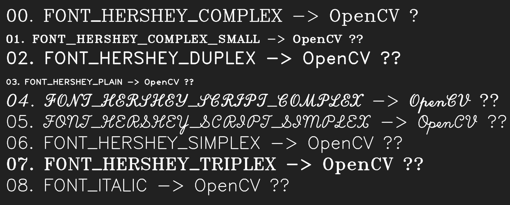

# image_analysis
Any kind of images analysis with using python scripts (cv2 and PIL library)

You can find here scripts like:

  - cat_images -> for concatenate images in vertical or horizontal way
  
  - image_to_ascii -> which let you to convert image to ascii-art
  
  - roll_image
  
  - roll_layers -> to move RGB layers
  
  - and few others useless scripts
  

## Example of ascii-art, generated from image

## Example of roll_layers script output

## Example of move_stripes script output

## Opencv fonts

